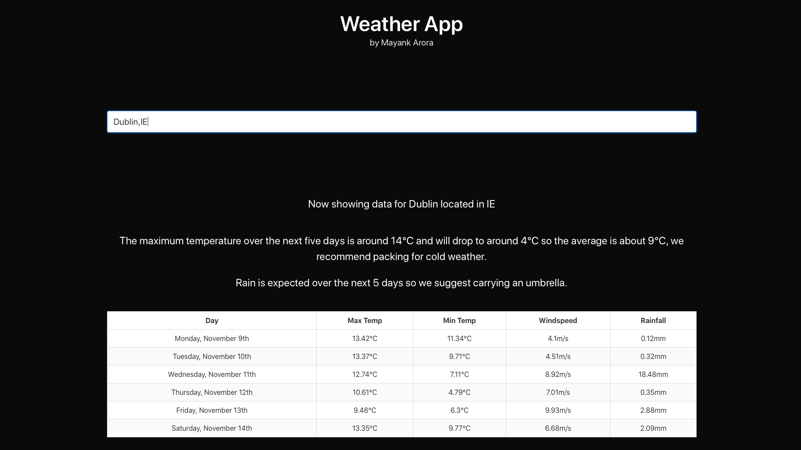

# Assignments for Internet Applications module

## Assignment1 - Weather App

The server is written in nodeJS and the frontend is made using Vue. Bulma framework is used to style the webpage.

* use 'npm install' to install the required packages
* use 'npm run dev' to start the server

